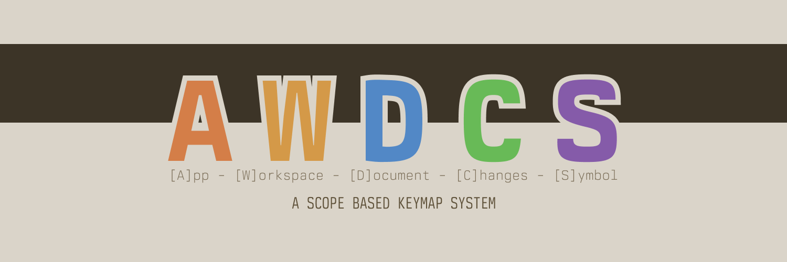

# AWDCS

<div align="center">
  
</div>

## Philosophy

Traditional modal editor keymaps typically organize bindings by tool or function.

But I noticed a pattern in my thinking: I always consider the scope first.

- I want to toggle the **App** keymaps.
- I want to search the entire **Workspace** for...
- I want to look in this **Document** for...
- I want to do something with this **Change**...
- I want to rename that **Symbol**...

**That's when I decided to adapt my modal editor to this mental model.**

This system takes a different approach by organizing mappings based on their scope of operation:

```
<Scope><?Group?><Operation>
```

- **[A]pp** (`<leader>a`) - Application-level operations
- **[W]orkspace** (`<leader>w`) - Operations affecting the entire workspace
- **[D]ocument** (`<leader>d`) - Operations on the current document
- **[C]hange** (`<leader>c`) - Operations on a change (Hunk)
- **[S]ymbol** (`s`) - Operations on code symbols (Can also be used as `<leader>s`)

## Design Principles

- **Scope First**
  - Every operation must clearly belong to a specific scope (workspace, document, symbol)
  - The scope should be immediately obvious from the operation's nature
- **Semantic Operations**
  - Mappings should represent clear, meaningful operations
  - Focus on frequently used operations that benefit from quick access
  - Focus on what the operation means, not how it's implemented
- **Clear & Specific Naming**:
  - Use clear, specific terms that accurately describe operations
  - Be pragmatic with tool names: use "Version" for version control, "LSP" for language features
  - While tool-agnostic design is ideal, explicit names prevent confusion when operations are inherently tied to specific tools
  - Implementation details are still left to the user's configuration
- **Preserve Editor Defaults**:
  - Don't replace basic editor operations with custom mappings
  - Focus on operations that enhance rather than replace core functionality
  - Leave common editor commands in their traditional form
- **Consistent Patterns**:
  - Second key should relate to the action within the scope
  - Related operations should share the same scope
  - Maintain predictable patterns across all mappings
- **Single Source**:
  - Each operation should have exactly one mapping
  - Avoid duplicate mappings across different key combinations
  - Choose the most appropriate and efficient mapping location

## Leader Key

I personally use (and recommend) `,` as my leader key, but you can use any key you like.
This way we use both hands in combination when typing the keymaps, which reduces strain by balancing the workload on the fingers.
Also I find that the the middle finger is faster than the thumb, which is generally a good thing, but also very nice to quickly double tap the leader key, to reach the command mode.

## Keymap

### Alphabetical Order

All keybindings in each scope are listed alphabetically for easier reference and maintenance, not by frequency of use or importance.

### Ergonomic Design

When using `,` as the leader key, the system naturally creates efficient left-hand finger patterns. The scope key (first key after leader) and the operation key (second key) are often adjacent or nearby on the keyboard (e.g., `sa`, `we`, `wd`), minimizing finger travel and creating comfortable rolling motions for the left hand. This ergonomic benefit is a fortunate consequence of the alphabetical organization combined with the QWERTY layout's letter placement.

### Capital Letter Pattern (Variants)

When an operation has multiple UI implementations (e.g., transient picker vs. persistent panel), capital letters distinguish the variants:

- **Lowercase**: Transient/picker-based UI (e.g., `<leader>wgh` - Git history picker)
- **Uppercase**: Static/persistent UI (e.g., `<leader>wgH` - Git history in LazyGit, `<leader>dP` - Problems in Trouble panel)

This pattern applies consistently across similar operations where both quick-access (picker) and deep-dive (persistent) interfaces are available.

### `<leader>a` - [A]pp

| Keybinding    | Mnemonic                   | Description                                            | Notes                                                                                                                |
| ------------- | -------------------------- | ------------------------------------------------------ | -------------------------------------------------------------------------------------------------------------------- |
| `<leader>aa`  | `A`pp `A`ctions            | Show available app actions / commands                  |
| `<leader>ad`  | `A`pp `D`ocument           | Open document from any workspace                       | If available. (e.g. `file-surfer.nvim`)                                                                              |
| `<leader>af`  | `A`pp `F`ocus              | Focus Mode                                             |
| `<leader>ag`  | `A`pp `V`ersion            | Show version control                                   | e.g. LazyGit                                                                                                         |
| `<leader>ah`  | `A`pp `H`elp               | Show help submenu                                      | Submenu for documentation, manuals, and help resources                                                               |
| `<leader>ahh` | `A`pp `H`elp `H`ighlights  | Show syntax highlights                                 |                                                                                                                      |
| `<leader>ahk` | `A`pp `H`elp `K`eybindings | Show keybindings                                       |                                                                                                                      |
| `<leader>ahm` | `A`pp `H`elp `M`anuals     | Show man pages                                         |                                                                                                                      |
| `<leader>ahp` | `A`pp `H`elp `P`ages       | Show help pages                                        |                                                                                                                      |
| `<leader>ai`  | `A`pp `I`ntelligence       | Show AI tools                                          | If available.                                                                                                        |
| `<leader>aj`  | `A`pp `J`umps              | Show application jump list                             | If available.                                                                                                        |
| `<leader>al`  | `A`pp `L`anguages          | Show language servers submenu                          | Submenu for LSP and language server management                                                                       |
| `<leader>ali` | `A`pp `L`anguages `I`nfo   | Show LSP information                                   |                                                                                                                      |
| `<leader>all` | `A`pp `L`anguages `L`og    | Open LSP log                                           |                                                                                                                      |
| `<leader>als` | `A`pp `L`anguages `S`erver | Open Mason (server manager)                            |                                                                                                                      |
| `<leader>an`  | `A`pp `N`otifications      | Show notifications                                     |
| `<leader>ao`  | `A`pp `O`ptions            | Toggle app options like Background, Line numbers, etc. |
| `<leader>ap`  | `A`pp `P`lugins            | Manage plugins                                         |
| `<leader>ar`  | `A`pp `R`ecent             | Open recently visited documents accross all workspace  | If available.                                                                                                        |
| `<leader>as`  | `A`pp `S`ettings           | Toggle app settings                                    | In Neovim this would let us fuzzy find config files, and on a mac app this would lead us to `settings.json`. (cmd-,) |
| `<leader>at`  | `A`pp `T`hemes             | Switch theme or colorscheme                            |
| `<leader>aw`  | `A`pp `W`orkspace          | Open workspace                                         |
| `<leader>az`  | `A`pp `Z`oom               | Zoom Mode                                              |

### `<leader>w` - [W]orkspace

| Keybinding     | Mnemonic                                            | Description                         | Notes                                                                                                 |
| -------------- | --------------------------------------------------- | ----------------------------------- | ----------------------------------------------------------------------------------------------------- |
| `<leader>wc`   | `W`orkspace `C`hanges                               | Show changes/hunks in workspace     | Picker for individual hunks/changes (git diff)                                                        |
| `<leader>wd`   | `W`orkspace `D`ocument                              | Find document in workspace          |
| `<leader>we`   | `W`orkspace `E`xplorer                              | Open file explorer                  |
| `<leader>wf`   | `W`orkspace `F`ind                                  | Find and replace in workspace       | Optional: Maybe not needed, if the editor offers a replace field under `<leader>wt`.                  |
| `<leader>wj`   | `W`orkspace `J`umps                                 | Show workspace jumps                | Jump list for workspace-level navigation                                                              |
| `<leader>wm`   | `W`orkspace `M`odified                              | Show modified documents             | List of modified files (git status)                                                                   |
| `<leader>wp`   | `W`orkspace `P`roblems                              | Show workspace diagnostics          |
| `<leader>wr`   | `W`orkspace `R`ecent                                | Show recently visited documents     | Optional: Maybe not needed, if editor merges recently opend documents in `<leader>wd`.                |
| `<leader>ws`   | `W`orkspace `S`ymbol                                | Find symbol in workspace            |
| `<leader>wt`   | `W`orkspace `T`ext                                  | Find text in workspace              |
| `<leader>wv`   | `W`orkspace `V`ersion                               | Show version submenu                | Submenu for all version control operations                                                            |
| `<leader>wvb`  | `W`orkspace `V`ersion `B`ranches                    | Show version branches               |                                                                                                       |
| `<leader>wvh`  | `W`orkspace `V`ersion `H`istory                     | Show version history (picker)       |                                                                                                       |
| `<leader>wvH`  | `W`orkspace `V`ersion `H`istory                     | Show version history (interactive)  | If available (e.g., LazyGit)                                                                          |
| `<leader>wvi`  | `W`orkspace `V`ersion `I`ssues                      | Show issues submenu                 | If available (GitHub integration). Namespace for issue operations.                                    |
| `<leader>wvib` | `W`orkspace `V`ersion `I`ssues `B`rowse             | Browse GitHub issues                | If available (GitHub integration)                                                                     |
| `<leader>wvp`  | `W`orkspace `V`ersion `P`ull Requests               | Show pull requests submenu          | If available (GitHub integration). Namespace for PR operations.                                       |
| `<leader>wvpb` | `W`orkspace `V`ersion `P`ull Requests `B`rowse      | Browse pull requests                | If available (GitHub integration)                                                                     |
| `<leader>wvpc` | `W`orkspace `V`ersion `P`ull Requests `C`hanges     | Show current PR changes             | If available (GitHub integration)                                                                     |
| `<leader>wvpd` | `W`orkspace `V`ersion `P`ull Requests `D`escription | Show current PR description         | If available (GitHub integration)                                                                     |
| `<leader>wvr`  | `W`orkspace `V`ersion `R`emote                      | Open remote repository              |                                                                                                       |
| `<leader>wvs`  | `W`orkspace `V`ersion `S`tatus                      | Show version status (interactive)   | If available (e.g., LazyGit)                                                                          |
| `<leader>ww`   | `W`orkspace `W`ord                                  | Find word under cursor in workspace | Optional: Maybe not needed if the editor uses the selection under the cursor when using `<leader>wt`. |

### `<leader>d` - [D]ocument

| Shortcut      | Mnemonic                       | Description                                 | Notes                                         |
| ------------- | ------------------------------ | ------------------------------------------- | --------------------------------------------- |
| `<leader>da`  | `D`ocument `A`ssociated        | Find associated documents                   |
| `<leader>dc`  | `D`ocument `C`hanges           | Show document changes (if available)        |
| `<leader>df`  | `D`ocument `F`ind              | Find and replace in document                |
| `<leader>dl`  | `D`ocument `L`ast              | Switch to last document                     | <C-^> in Neovim                               |
| `<leader>dp`  | `D`ocument `P`roblems          | Show document diagnostics                   |
| `<leader>ds`  | `D`ocument `S`ymbol            | Find symbol in document                     |
| `<leader>dt`  | `D`ocument `T`ext              | Find text in document                       |
| `<leader>du`  | `D`ocument `U`ndo              | Open undo tree                              | If available.                                 |
| `<leader>dv`  | `D`ocument `V`ersion           | Show version submenu                        | Submenu for document-level version operations |
| `<leader>dvh` | `D`ocument `V`ersion `H`istory | Show document version history (picker)      |                                               |
| `<leader>dvH` | `D`ocument `V`ersion `H`istory | Show document version history (interactive) | If available (e.g., LazyGit)                  |
| `<leader>dvr` | `D`ocument `V`ersion `R`evert  | Revert changes                              |
| `<leader>dvs` | `D`ocument `V`ersion `S`tage   | Stage changes                               |
| `<leader>dw`  | `D`ocument `W`ord              | Find word under cursor in document          |
| `<leader>dya` | `D`ocument `Y`ank `A`ll        | Copy whole document                         |                                               |
| `<leader>dyp` | `D`ocument `Y`ank `P`ath       | Copy path of document                       | e.g. absolute, relative path, filename etc.   |
| `<leader>dyr` | `D`ocument `Y`ank `R`emote     | Copy remote path of document                | e.g. GitHub Perma link                        |

### `<leader>c` - [C]hange

| Shortcut     | Mnemonic          | Description         | Notes                                         |
| ------------ | ----------------- | ------------------- | --------------------------------------------- |
| `<leader>ca` | `C`hange `A`ll    | Show all changes    | If available. (e.g. `Snacks.picker.git_diff`) |
| `<leader>cd` | `C`hange `D`iff   | Show hunk diff      |
| `<leader>cg` | `C`hange `G`it    | Show hunk preview   | Toggle overlay/preview                        |
| `<leader>cr` | `C`hange `R`evert | Revert current hunk |
| `<leader>cs` | `C`hange `S`tage  | Stage current hunk  |
| `<leader>cu` | `C`hange `U`ndo   | Undo staged hunk    |

### `s` - [S]ymbol

> [!NOTE]
> Unlike other scopes, symbol operations do not use the leader key due to their high frequency of use.
> This intentional exception optimizes for efficiency while maintaining the semantic meaning of the scope.
> **But of course it is possible to just also use the leader prefix before that!**

> [!CAUTION]
> If you plan to use it without a leader prefix, and use Neovim, I would recommend to disable the default `s` Binding.
> Yes- this goes against the principle not to overwrite editor defaults, but it is (at least for me), not a used keymapping, and is also often overridden by other plugins and systems.

You can disable the default mapping in Neovim like so:

```lua
vim.keymap.set("n", "s", "<Nop>")
```

| Shortcut | Mnemonic                     | Description                   | Notes                                                         |
| -------- | ---------------------------- | ----------------------------- | ------------------------------------------------------------- |
| `sI`     | `S`ymbol `I`nspect           | Inspect symbol under cursor   |
| `sa`     | `S`ymbol `A`ctions           | Show symbol actions           |
| `sc`     | `S`ymbol `C`alls             | Show calls submenu            | Submenu for incoming/outgoing calls                           |
| `sci`    | `S`ymbol `C`alls `I`ncoming  | Show incoming calls           |                                                               |
| `sco`    | `S`ymbol `C`alls `O`utgoing  | Show outgoing calls           |                                                               |
| `sd`     | `S`ymbol `D`efinition        | Go to symbol definition       |
| `si`     | `S`ymbol `I`nfo              | Show symbol information       | Hover Information                                             |
| `sl`     | `S`ymbol `L`og               | Insert log for symbol         | If available. (e.g. Programmatically log symbol under cursor) |
| `sn`     | `S`ymbol `N`ame              | Rename symbol                 |
| `sr`     | `S`ymbol `R`eferences        | Show symbol references        |
| `st`     | `S`ymbol `T`ype              | Go to type definition         |
| `sv`     | `S`ymbol `V`ersion           | Show version submenu          | Submenu for symbol-level version operations                   |
| `svb`    | `S`ymbol `V`ersion `B`lame   | Show version blame for line   |                                                               |
| `svh`    | `S`ymbol `V`ersion `H`istory | Show version history for line |                                                               |

## Contributing

Feel free to:

- Suggest improvements to the scope organization
- Propose new scopes for uncovered contexts
- Share your adaptations for different editors

## License

MIT License - Feel free to adapt and use in your own configurations.
